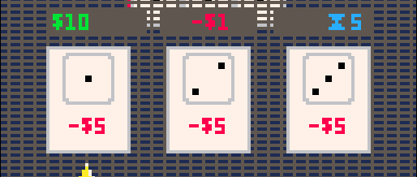

# Dicetro Concept Document

*[Modeled after Michael Sellers' template found here](https://drive.google.com/file/d/1-yiF2Pq-OgJaTXsMAQbIckoDzGINz26O/view?usp=sharing)*

## Table of Contents

1. [High Level Concept/Design](#high-level-conceptdesign)
2. [Product Design](#product-design)
3. [Game Systems Design](#game-systems-design)

## High Level Concept/Design

### Working Title

Dicetro

### Concept Statement

Dicetro is a retro, Balatro-inspired, roguelike where the player continuously rolls dice and buying upgrades, attempting to reach an increasingly high score requirement.

### Genre(s)

Casual/roguelike

### Unique Selling Points

### Team

| Name                  | Role(s)                           |
| :-------------------- | :-------------------------------- |
| Abraham Engebretson   | Programming, Music & Sound Design |
|                       |                                   |

## Product Design

### Player Experience and Game POV

The key element that makes this game enjoying and satisfying to play is immediate feedback. You should recerive immediate visual and/or auditory feedback when a dice lands, is scoreed, an effect is triggered, and when you pay the round requirement. When advancing through rounds, or dice are rolling, the player should need to wait the minimum amount of time between each action. While there might be some strategy involved in picking items from the shop, the goal is to be casual and engaging as opposed to require critical thinking.

### Visual and Audio Style

### Game World Fiction

### Monetization & Marketing

This game will be entirely free and available to play online and in-browser. No marketing is planned for this game other than a possible social media post on personal pages or sites.

### Platform(s) & Technology

This game will be made using the [PICO-8 fantasy console](https://www.lexaloffle.com/pico-8.php). By using this console, arbitrary technological restrictions have been placed on a number of different aspects of the host machine including

* CPU speed,
* token count in the source code,
* storage space for assets,
* 128x128 pixel display resolution,
* 16-color preset color palette.
* 6-button input with optional touch screen support

By following the restrictions of the PICO-8, it is possible to easily host these games in-browser on static webpages, via a local PICO-8 emulator, as well as on Single-Board-Computer retro handhelds.

#### Tooling

Included in this fantasy console is a [diverse API toolset](https://iiviigames.github.io/pico8-api/) and built-in editors for music and sprite creation.

#### File Structure

When developing for the PICO-8 fantasy console, you have the option of combining all source code into a sole `.p8` file or to include from external `.lua` files. The `_init()`, `_draw()`, and `_update()` API calls will be in the `.p8` file, while all other code will be in logically separated `.lua` files.

### Scope & Timeline

This game has no set timeline, but is planned to have a feature-complete and fuly playable version finished within the Summer/Fall of 2026.

## Game Systems Design

### Core Loops

The player will start by rolling a single 6-sided die and earn points equal to the total number of pips of the top-most face when landed. After the roll is scored, the player enters the shop where you can buy items from a selection of three

### Objectives & Progression

#### Items

| Item Name                       | Item Description                                      | Item Function                     | Rarity      |
| :------------------------------ | :---------------------------------------------------- | :-------------------------------- | :---------- |
|                                 |                                                       |                                   |             |

### Game Systems

